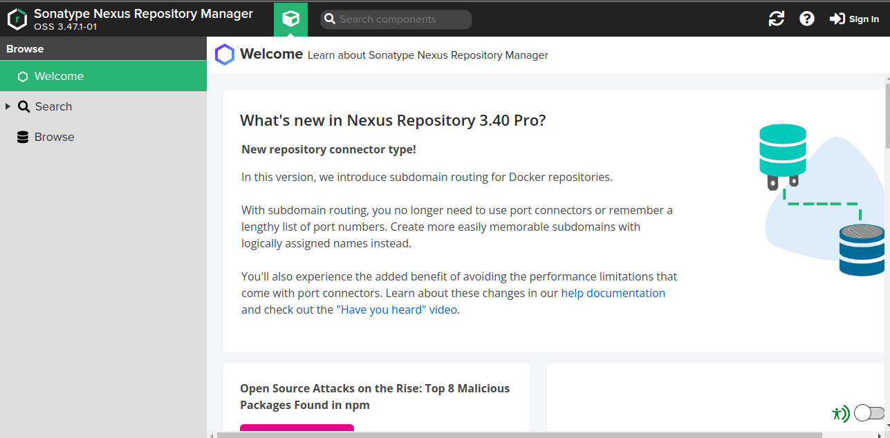

# nexus-sonarqube-ansible
This is a demo ansible , installing nexus and sonarqube on aws private instances using ansible and building infrastructure using terraform.
- Traffic access the private instances via loadbalancer.
- ansible access private instances using public instance as jump host.

## Notes before clonning.
- terraform builds inventory.txt file automatically when applying terraform.
- change key_pair names in Terraform/main.tf and in ec2 modules.
- copy your key to **nexus-sonarqube-ansible** directory.
- chmod 400 your private key.

## Commands to run:
### Terraform:
```
cd Terraform/
```
```
terraform init
```
```
sudo terraform apply
```

### Ansible:
```
cd ..
```
```
ansible-playbook playbook.yml -i inventory.txt
```
### Screenshots From reloading LoadBalancer:



